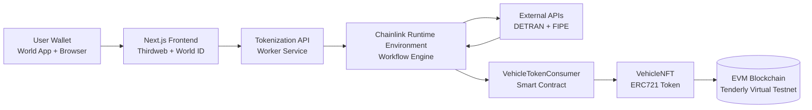
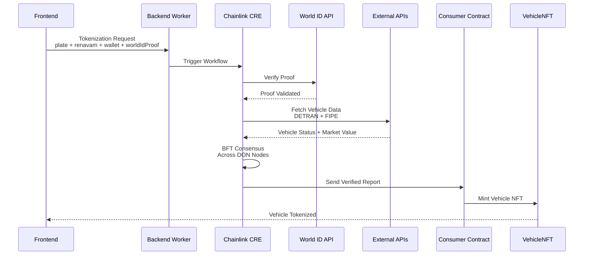

# 🚗 AutoLock DeFi - RWA Automotive Tokenization


AutoLock DeFi is a decentralized lending protocol that bridges **Brazilian vehicle ownership with global DeFi liquidity**.

By tokenizing vehicle titles as **Real World Assets (RWA)**, users can access **instant stablecoin liquidity** while maintaining verifiable ownership through blockchain.

The system combines:

* **Chainlink Runtime Environment (CRE)** for decentralized orchestration
* **World ID** for human verification
* **Thirdweb** for Web3 wallet and frontend integration
* **Tenderly Virtual Testnets** for blockchain infrastructure

---

# ⚠️ IMPORTANT — READ BEFORE CLONING

This project depends on several external platforms.

Before cloning the repository you **must create accounts and configure the following services**:

* Thirdweb
* World ID
* Tenderly

Each setup process is explained in dedicated setup guides.

📖 Please read these first:

- 📦 [Thirdweb Setup](README_THIRDWEB.md)
- 🧑‍🚀 [World ID Setup](README_WORLD_ID.md)
- ⛓️ [Tenderly Setup](README_TENDERLY.md)

These guides will show how to create accounts, generate keys and configure your environment variables.

---

# 🧰 Technologies Used

This project integrates multiple Web3 and infrastructure tools.

## Thirdweb

https://thirdweb.com/

Used for frontend wallet connection and Web3 interaction.

Setup guide:
➡️ `README_THIRDWEB.md`

---

## World ID

https://world.org/

Used to verify **human uniqueness** and prevent Sybil attacks.

Documentation:

https://docs.world.org/

Developer portal:

https://developer.worldcoin.org/

Setup guide:
➡️ `README_WORLD_ID.md`

---

## Tenderly

https://tenderly.co/

Used to run a **Virtual Testnet** for the project smart contracts.

Setup guide:
➡️ `README_TENDERLY.md`

---

# 📁 Project Structure

The repository is organized into multiple components:

```
rwa-chainlink-convergence
│
├── frontend
│   Next.js interface
│
├── worker
│   Backend worker responsible for triggering CRE workflows
│
├── detran-mock
│   Mock API simulating Brazilian vehicle registry data
│
├── event-listener
│   Rust listener that monitors blockchain events
│
├── auto-lock-defi
│   Chainlink Runtime Environment workflow
│
└── contracts
    Solidity smart contracts
```

Each component contains its own documentation.

---

# 📦 Clone the Repository

Once all required platforms are configured:

```bash
git clone https://github.com/<your-repo>
cd rwa-chainlink-convergence
```

---

# ⚙️ Environment Configuration

Before running the project you must configure three files:

```
.env
frontend/.env.local
auto-lock-defi/config.staging.json
```

These values come from the platforms configured earlier:

* Thirdweb
* World ID
* Tenderly

Refer to the setup guides if needed.

---

# 🚀 Install Dependencies

Run:

```bash
make install
```

This will install:

* Node dependencies
* Go dependencies
* Rust dependencies
* Smart contract build
* CRE bindings

---

# 🧱 Deploy Smart Contracts

```bash
make deploy
```

This deploys:

* VehicleNFT
* VehicleTokenConsumer
* Ownership configuration

---

# ▶️ Start the Platform

Run the full stack:

```bash
make up
```

Services started:

* Frontend
* Worker
* DETRAN mock API
* Blockchain event listener

---

# 🧪 Optional — Run CRE Simulation

You can validate the RWA workflow with:

```bash
make simulate-rwa
```

---

# 📚 Additional Documentation

Detailed setup guides:

* `README_THIRDWEB.md`
* `README_WORLD_ID.md`
* `README_TENDERLY.md`

Component documentation:

* `frontend/README.md`
* `worker/README.md`
* `event-listener/README.md`
* `auto-lock-defi/README.md`

---

# 👨‍💻 Hackathon Project

This project was developed as part of the **Chainlink CRE ecosystem**, demonstrating how decentralized workflows can tokenize real-world assets.

Core features:

* Real World Asset tokenization
* Human verification via World ID
* Decentralized oracle execution
* Automated NFT minting

## Flow and Diagram

### E2E Architecture Flow

## System Architecture



### CRE Workflow (Trigger → Action → Target)

## CRE Workflow Architecture

