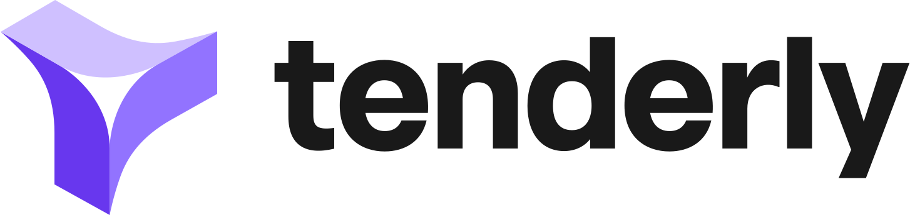

# 🚗 AutoLock DeFi - RWA Automotive Tokenization


AutoLock DeFi is a protocol for **tokenizing real-world vehicles as blockchain assets**.

The system converts vehicle ownership data into **ERC-721 NFTs**, enabling the creation of **Real World Assets (RWA)** that can be integrated with decentralized finance.

# 🤝 Technology Stack

<p align="center">
  
  
  
  
</p>

The platform integrates:

• **Chainlink Runtime Environment (CRE)** for decentralized workflow orchestration  
• **World ID** for human verification  
• **Thirdweb** for wallet and frontend integration  
• **Tenderly Virtual Testnet** for blockchain infrastructure

---

# 🏗 Architecture Overview

The protocol architecture is composed of four main layers:

```
Frontend
↓
Worker API
↓
Chainlink CRE Workflow
↓
Smart Contracts
```

Detailed architecture documentation:

📖 **System Architecture**  
➡️ [Docs](README_ARCHITECTURE.md)

---

# 📚 Component Documentation

Each component of the system has its own documentation.

| Component | Documentation |
|--------|--------|
| CRE Workflow | [docs](auto-lock-defi/README.md) |
| Frontend | [docs](frontend/README_FRONTEND.md) |
| Worker | [docs](worker/README.md) |
| API Mocks | [docs](mocks/README.md) |
| Smart Contracts | [docs](contracts/README.md) |
| Event Listener | [docs](event-listener/README.md) |

---

# ⚠️ Setup Requirements

This project depends on external platforms.

Before running the project you must configure accounts for:

• Thirdweb  
• World ID  
• Tenderly  

Setup guides:

- 📦 [Thirdweb Setup](README_THIRDWEB.md)
- 🧑‍🚀 [World ID Setup](README_WORLD_ID.md)
- ⛓️ [Tenderly Setup](README_TENDERLY.md)

---

# 📁 Project Structure

```
rwa-chainlink-convergence
│
├── frontend
│   Next.js Web3 interface
│
├── worker
│   Backend orchestrator triggering CRE workflows
│
├── mocks
│   Mock APIs for vehicle registry data
│
├── event-listener
│   Rust service monitoring blockchain events
│
├── auto-lock-defi
│   Chainlink Runtime Environment workflow
│
└── contracts
    Solidity smart contracts
```

---

# 🛠 Prerequisites

Before running this project you must install the following tools.

These dependencies are required to build the smart contracts, run the backend services and execute the CRE workflow.

### Go

Used for the **Worker backend service**.

Install guide:  
https://go.dev/doc/install

---

### Rust

Used for the **event listener service**.

Install using:

```bash
curl https://sh.rustup.rs -sSf | sh
```

Official documentation:  
https://www.rust-lang.org/tools/install

---

### Node.js

Used for the **frontend application and JavaScript dependencies**.

Used for this development: **Node v24.10.0+**

Download:  
https://nodejs.org/

---

### Foundry (Forge)

Used to **compile and deploy the Solidity smart contracts**.

Install:

```bash
curl -L https://foundry.paradigm.xyz | bash
foundryup
```

Documentation:  
https://book.getfoundry.sh/

---

### Chainlink CRE CLI

Used to **run and simulate the Chainlink Runtime Environment workflows**.

Installation instructions:  
https://docs.chain.link/cre/

---

### Make

Used to run the project automation commands:

```
make install
make deploy
make up
```

Install guide:  
https://www.gnu.org/software/make/

---

# ⚙️ Environment Configuration

Before running the project you **must configure the required environment files**.

The system depends on configuration values coming from:

- Thirdweb
- World ID
- Tenderly

Create and configure the following files:

```
.env
frontend/.env.local
auto-lock-defi/config.staging.json
```

These files contain the keys and configuration required for:

• wallet connection  
• identity verification  
• CRE workflow execution  
• blockchain infrastructure  

If you haven't configured the external services yet, please follow the setup guides:

- 📦 [Thirdweb Setup](README_THIRDWEB.md)
- 🧑‍🚀 [World ID Setup](README_WORLD_ID.md)
- ⛓️ [Tenderly Setup](README_TENDERLY.md)

---

# 🚀 Install Dependencies

Run:

```bash
make install
```

This will install:

* Node dependencies
* Go dependencies
* Rust dependencies
* Smart contract build
* CRE bindings

---

# 🧱 Deploy Smart Contracts

```bash
make deploy
```

This deploys:

* VehicleNFT
* VehicleTokenConsumer
* Ownership configuration

---

# ▶️ Start the Platform

Run the full stack:

```bash
make up
```

Services started:

* Frontend
* Worker
* DETRAN mock API
* Blockchain event listener

---

# 🧪 Optional — Run CRE Simulation

You can validate the RWA workflow with:

```bash
make simulate-rwa
```

---

# 👨‍💻 Hackathon Project

This project was developed as part of the **Chainlink CRE ecosystem**.

The goal is to demonstrate how decentralized workflows can be used to tokenize **real-world assets**.

Core features:

• vehicle registry verification  
• human identity verification  
• decentralized oracle execution  
• automated NFT minting

---


⚠️ Judges: For a complete technical explanation of the system design, please read the architecture documentation:

📖 **System Architecture Guide**

➡️ [README_ARCHITECTURE.md](README_ARCHITECTURE.md)

This document explains in detail:

• the full system architecture  
• CRE workflow execution  
• oracle consensus model  
• smart contract settlement layer  
• security design of the protocol  

---

# 📚 Development References

These are the main resources used during the development of this project.

## Chainlink CRE

### Project Configuration

https://docs.chain.link/cre/reference/project-configuration-go#checking-your-versions

### Onchain Write Capability

https://docs.chain.link/cre/guides/workflow/using-evm-client/onchain-write/overview-go

### Forwarder Directory

https://docs.chain.link/cre/guides/workflow/using-evm-client/forwarder-directory-go#simulation-mainnets

### Consumer Contract (ReceiverTemplate)

https://docs.chain.link/cre/guides/workflow/using-evm-client/onchain-write/building-consumer-contracts#3-using-receivertemplate

---

## World ID

| Resource | Link |
|------|------|
IDKit Integration | https://docs.world.org/world-id/idkit/integrate |
React Integration | https://docs.world.org/world-id/idkit/react |
Legacy Credential Presets | https://docs.world.org/world-id/credentials/legacy-presets |
Authenticator Reference | https://docs.world.org/world-id/reference/authenticator |

---

## thirdweb

Developer Documentation:

https://portal.thirdweb.com/references/typescript/v5