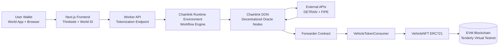
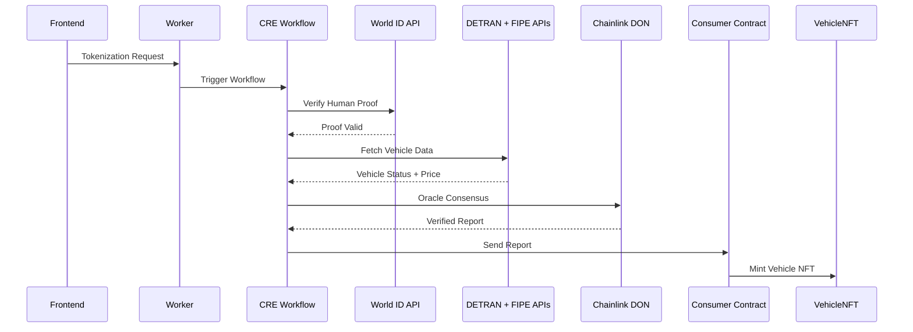

# 🧠 AutoLock DeFi – System Architecture

AutoLock DeFi is a **Real World Asset (RWA) tokenization protocol** designed to bridge Brazilian vehicle ownership with decentralized finance.

The system allows vehicle owners to tokenize their vehicles as **ERC-721 NFTs**, enabling them to access **DeFi liquidity backed by real-world assets**.

The protocol integrates multiple layers:

• Web3 frontend  
• backend orchestration  
• decentralized oracle execution  
• smart contract settlement  

The architecture ensures that **vehicle tokenization only occurs when verified real-world data and human identity checks are successfully validated**.

---

# 📚 Project Documentation

Each component of the system has its own documentation.

| Component | Documentation |
|--------|--------|
| CRE Workflow | `auto-lock-defi/README.md` |
| Frontend | `frontend/README_FRONTEND.md` |
| Worker | `worker/README.md` |
| External API Mocks | `mocks/README.md` |
| Smart Contracts | `contracts/README.md` |

These documents explain each subsystem in detail.

---

# 🏗 System Architecture

The protocol is composed of multiple layers working together.

```
Frontend
↓
Worker API
↓
Chainlink CRE Workflow
↓
Chainlink DON Oracle Network
↓
Forwarder Contract
↓
Consumer Contract
↓
VehicleNFT Contract
```

---

# Full Architecture Diagram



---

# 🔁 Tokenization Flow

The vehicle tokenization process follows a deterministic pipeline.

```
User connects wallet
↓
User submits vehicle data
↓
User verifies identity with World ID
↓
Frontend sends tokenization request
↓
Worker triggers CRE workflow
↓
Oracle network verifies external data
↓
Verified report sent on-chain
↓
Vehicle NFT minted
```

---

# CRE Workflow Architecture

The **Chainlink Runtime Environment (CRE)** orchestrates the verification pipeline.

The workflow is built using the **Trigger → Action → Target** model.

```
Trigger
↓
Identity Verification
↓
Vehicle Registry Validation
↓
Market Price Oracle
↓
Consensus
↓
On-chain Settlement
```

### CRE Execution Flow



---

# 🧑 Human Verification (World ID)

The protocol integrates **World ID** to prevent Sybil attacks.

Each tokenization request must include a **valid World ID proof**.

The workflow verifies:

• proof validity  
• nullifier uniqueness  
• proof signature  

This guarantees that **each tokenization request originates from a unique human**.

---

# 🚗 Vehicle Verification

Vehicle information is validated through **external registry APIs**.

The oracle network fetches:

• vehicle ownership status  
• registry validity  
• vehicle metadata  

This ensures that **only legitimate vehicles can be tokenized**.

---

# 💰 Vehicle Valuation (FIPE)

The protocol retrieves vehicle market value using the **Brazilian FIPE price index**.

FIPE is the official reference used by:

• banks  
• insurers  
• financial institutions  

The oracle workflow retrieves:

• market reference price  
• vehicle category  
• valuation metadata  

These values are stored in the NFT metadata.

---

# 🔐 Security Model

The system protects against several attack vectors.

### Sybil Attacks

Mitigated through **World ID human verification**.

### Fake Asset Tokenization

Prevented through **oracle-verified vehicle registry data**.

### Unauthorized NFT Minting

Blocked through **ownership transfer of the NFT contract to the Consumer contract**.

### Oracle Manipulation

Mitigated through **Chainlink DON Byzantine Fault Tolerant consensus**.

---

# 🔗 Smart Contract Layer

The on-chain settlement layer consists of three contracts.

| Contract | Responsibility |
|--------|--------|
| VehicleNFT | ERC721 token representing the vehicle |
| VehicleTokenConsumer | Receives oracle reports |
| Forwarder | Validates and forwards oracle reports |

The mint permission chain:

```
CRE Workflow
↓
Forwarder
↓
Consumer Contract
↓
VehicleNFT mint
```

This guarantees that NFTs are only minted from **verified oracle reports**.

---

# 🧱 Protocol Components

## Frontend

User interface responsible for wallet interaction and identity verification.

Documentation:

```
frontend/README_FRONTEND.md
```

---

## Worker

Backend service responsible for triggering CRE workflows.

Documentation:

```
worker/README.md
```

---

## CRE Workflow

Chainlink workflow responsible for orchestrating verification and oracle execution.

Documentation:

```
auto-lock-defi/README.md
```

---

## External API Mocks

Mock APIs simulating vehicle registry and pricing services.

Documentation:

```
mocks/README.md
```

---

## Smart Contracts

Solidity contracts responsible for NFT minting and settlement.

Documentation:

```
contracts/README.md
```

---

# 🎯 Summary

AutoLock DeFi demonstrates how **decentralized oracle workflows can securely tokenize real-world assets**.

By combining:

• World ID human verification  
• Chainlink CRE orchestration  
• decentralized oracle consensus  
• secure smart contract design  

the protocol enables **trust-minimized tokenization of physical assets on blockchain infrastructure**.