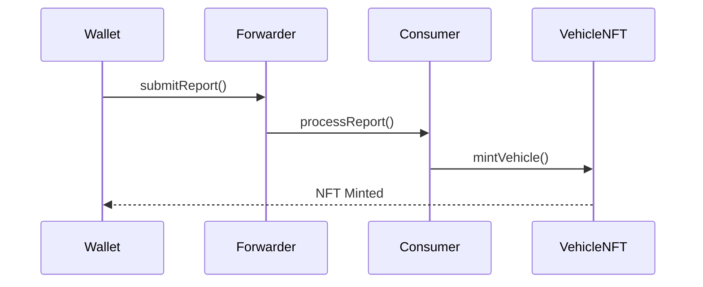
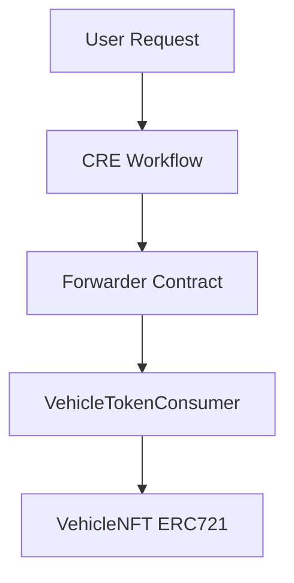

# Smart Contracts Architecture

This project includes a set of smart contracts responsible for handling the tokenization of vehicles as **Real World Assets (RWA)**.

The contracts were designed to integrate with the **Chainlink Runtime Environment (CRE)** and follow a secure oracle-driven execution model.

The architecture ensures that **external verified data** is used to mint NFTs representing real-world vehicles.

---

# How CRE and Virtual Testnets Solve This Problem

Tokenizing real-world assets requires combining **off-chain verification with on-chain settlement**.

In this project, vehicle ownership must be validated through external systems before a blockchain asset can be minted. This introduces multiple challenges:

- verifying identity
- validating real-world vehicle data
- securely transmitting verified data to smart contracts

Traditionally this requires building complex backend infrastructure that coordinates APIs, verification systems, and blockchain transactions.

This project solves that problem by using the **Chainlink Runtime Environment (CRE)** together with **Tenderly Virtual Testnets**.

---

## Chainlink Runtime Environment (CRE)

The **CRE acts as the orchestration layer** of the system.

Instead of implementing multiple backend services, the workflow logic is executed inside a **deterministic off-chain execution environment** that can securely interact with both Web2 APIs and blockchain smart contracts.

The CRE workflow is responsible for:

- verifying the user's **World ID proof**
- retrieving vehicle data from **DETRAN APIs**
- generating a verified vehicle report
- sending the report to the on-chain contracts

This ensures that the tokenization pipeline is **deterministic, auditable, and secure**.

The workflow effectively bridges:
```
Real-world data → Oracle verification → On-chain settlement
```


---

## Tenderly Virtual Testnet

Developing oracle-driven systems can be complex because it normally requires interacting with live blockchain infrastructure.

To simplify development and testing, this project uses **Tenderly Virtual Testnets**.

Tenderly provides:

- instant blockchain environments
- deterministic transaction simulations
- full contract debugging
- isolated testing environments

Using a Virtual Testnet allows the system to behave **exactly like a real blockchain network** while remaining fully controllable during development.

This makes it possible to:

- deploy contracts
- simulate CRE executions
- test oracle interactions
- debug transactions

without requiring a public testnet.

---

## Why This Matters

By combining **CRE workflows with Tenderly Virtual Testnets**, this architecture enables developers to build **complex hybrid Web2 + Web3 systems** with significantly less infrastructure.

In this project the result is a secure pipeline where:

1. Identity is verified with World ID
2. Vehicle data is validated through external APIs
3. Oracle reports are generated through CRE
4. Smart contracts mint NFTs representing real-world vehicles

This demonstrates how **Chainlink CRE can power real-world asset tokenization systems in a secure and deterministic way.**

---

# Contracts Overview

The system includes three main contracts:

| Contract | Responsibility |
|--------|--------|
| VehicleNFT | ERC721 token representing the tokenized vehicle |
| VehicleTokenConsumer | Receives verified oracle reports and triggers NFT minting |
| Forwarder | Validates and forwards oracle reports to the consumer contract |

---

# VehicleNFT Contract

The **VehicleNFT** contract is responsible for minting NFTs representing real-world vehicles.

Each NFT contains metadata such as:

- vehicle plate  
- renavam  
- vehicle value  
- metadata URI  

Example mint function:

```solidity
function mintVehicle(
    address owner,
    string memory plate,
    string memory renavam,
    uint256 value,
    string memory uri
) external;
```

This contract represents the final settlement layer of the tokenization process.

Only authorized contracts can mint NFTs.

---

# VehicleTokenConsumer Contract

The **VehicleTokenConsumer** contract is the entry point for oracle reports produced by the CRE workflow.

This contract extends the Chainlink **ReceiverTemplate**, which provides a standardized mechanism for receiving oracle reports through the **Forwarder contract**.

When the CRE workflow finishes executing, it sends an encoded report to the Forwarder, which then calls the Consumer contract.

The Consumer decodes the report and triggers the NFT minting process.

Example report structure:

```solidity
struct VehicleReport {
    address owner;
    string plate;
    string renavam;
    uint256 value;
    string uri;
}
```

The report is received and decoded inside:

```solidity
_processReport(bytes calldata report)
```

Inside this function, the encoded report is converted into a `VehicleReport` struct and used to mint the NFT:

```solidity
vehicleNFT.mintVehicle(...)
```

This architecture ensures that only verified oracle reports can trigger NFT minting, preventing unauthorized asset creation.

## ReceiverTemplate Integration

The `VehicleTokenConsumer` contract extends the Chainlink `ReceiverTemplate`.

This template provides a standard mechanism for receiving oracle reports from the Forwarder contract.

The CRE workflow sends an encoded report that is decoded and processed inside:

_processReport(bytes calldata report)

This function extracts the report data and triggers the NFT mint operation.

---

# Forwarder Contract

The **Forwarder contract** is part of the Chainlink architecture.

Its purpose is to validate oracle reports and securely forward them to the consumer contract.

Production architecture:

```
Chainlink DON → Forwarder → Consumer Contract
```

For this project, since we are using a **Tenderly Virtual Testnet**, we deployed a **Mock Forwarder** that simulates this behavior.

This allows us to maintain the same architecture that would be used in production.

## Forwarder Execution Flow



---

# Ownership Model

Ownership was designed to enforce secure minting permissions.

Deployment flow:

1. Deploy `VehicleNFT`
2. Deploy `VehicleTokenConsumer`
3. Transfer ownership of `VehicleNFT` to the Consumer contract

Example:

```solidity
vehicleNFT.transferOwnership(consumerAddress);
```

## Why Ownership Transfer?

The ownership transfer ensures that:

- Only the Consumer contract can mint NFTs
- Users cannot mint assets directly
- Only verified oracle reports trigger tokenization

This protects the system against unauthorized asset minting.

---

# Mint Security Model

Mint permissions follow this chain of trust:

```
CRE Workflow
     ↓
Forwarder
     ↓
Consumer Contract
     ↓
VehicleNFT mint
```

This ensures that the NFT is minted only when:

- World ID verification passes
- DETRAN vehicle data is validated
- The oracle report is accepted

---

# Contracts Interaction Flow

## Onchain Tokenization Flow



---

# Why This Architecture Matters

Real-world asset tokenization requires:

- trusted data sources
- secure contract execution
- protection against unauthorized minting

This architecture guarantees that:

- NFTs are minted only from verified oracle data
- users cannot mint assets directly
- the workflow remains deterministic and auditable

---

# Summary

The smart contracts provide the **on-chain settlement layer** of the system.

By combining:

- Chainlink CRE  
- Forwarder validation  
- Consumer contract logic  
- secure ownership control  

we ensure that **real-world assets are tokenized in a secure and verifiable way**.