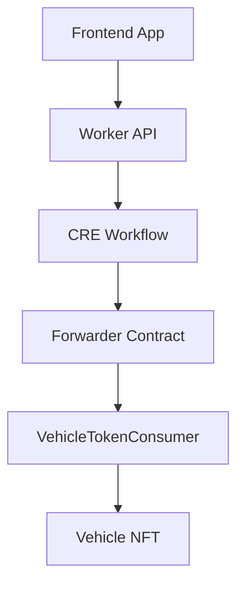

# Frontend Architecture

The frontend is responsible for providing the user interface for the vehicle tokenization workflow.

It allows users to:

- connect their wallet **Third Web**
- verify their identity using **World ID**  
- submit vehicle data to the worker that trigger the **CRE tokenization workflow**  
- visualize the resulting **NFT transaction**

The goal of the frontend is to provide a **simple and secure UX** for interacting with a complex **hybrid Web2 + Web3 system**.

---

# Technologies Used

The frontend is built using modern Web3 tooling.

| Technology | Purpose |
|-----------|--------|
| Next.js | Application framework |
| React | UI component architecture |
| Thirdweb | Wallet connection and blockchain interaction |
| World ID Kit | Human verification |
| React Query | API state management |
| Framer Motion | UI animations |
| Lucide Icons | UI iconography |
| TailwindCSS | Styling |

This stack allows rapid development while maintaining **high UX quality and Web3 compatibility**.

---

# Frontend User Flow

The user journey was designed to minimize friction while maintaining strong security guarantees.

User Flow:

```
User opens the application
↓
User connects wallet using Thirdweb
↓
User inputs vehicle data (plate + renavam)
↓
User verifies identity with World ID
↓
Frontend sends request to backend Worker
↓
Worker triggers CRE workflow
↓
CRE performs verification and oracle fetch
↓
Smart contract mints Vehicle NFT
↓
Frontend displays transaction link
```

---

# Frontend → Backend Interaction

The frontend **does not interact directly with the smart contracts**.

Instead it sends a request to the backend **Worker**, which triggers the **CRE workflow**.

This architecture ensures:

- sensitive verification logic remains **off-chain**
- the frontend remains **lightweight**
- oracle workflows remain **deterministic**

Example request payload:

```
POST /api/tokenize
```

Payload structure:

```json
{
  "wallet": "0x...",
  "plate": "ABC1234",
  "renavam": "123456789",
  "worldIdProof": {}
}
```

---

# Identity Verification UX

Identity verification is performed using **World ID**.

The frontend integrates the **World ID Kit**, allowing users to verify their humanity using the **World App**.

Steps:

```
User clicks verify identity
↓
World ID modal opens
↓
User confirms proof using World App
↓
Proof is returned to the frontend
↓
Proof is sent to the Worker API
```

This prevents **Sybil attacks** during asset tokenization.

---

# Transaction Visualization

Once the NFT is minted, the frontend generates a **transaction link** using the **Tenderly explorer**.

Example:

```
NEXT_PUBLIC_EXPLORER_TX_URL/tx_hash
```

This allows the user to directly inspect the blockchain transaction.

---

# UX Design Goals

The UX was designed with the following principles:

### Simplicity

Users interact with a simple interface while complex verification happens in the background.

### Transparency

Users can inspect every transaction through the Tenderly explorer.

### Security

Identity verification and oracle validation ensure that **only legitimate assets are tokenized**.

---

# Frontend Architecture Overview



---

# Summary

The frontend provides a **clean and secure interface** for interacting with the tokenization protocol.

By combining:

- wallet connection  
- identity verification  
- oracle workflows  
- blockchain transactions  

the application enables users to **tokenize real-world vehicles with a simple and transparent user experience**.

---

# World ID References

| Resource | Link |
|------|------|
IDKit Integration | https://docs.world.org/world-id/idkit/integrate |
React Integration | https://docs.world.org/world-id/idkit/react |
Legacy Credential Presets | https://docs.world.org/world-id/credentials/legacy-presets |
Authenticator Reference | https://docs.world.org/world-id/reference/authenticator |

---