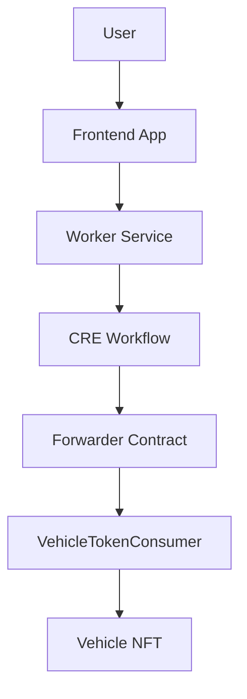

# Worker Architecture

The **Worker** acts as the backend gateway between the frontend application and the **Chainlink Runtime Environment (CRE)**.

Its primary responsibility is to **receive tokenization requests from the frontend and trigger the CRE workflow simulation**.

The Worker does not perform oracle logic itself. Instead, it orchestrates the execution of the CRE workflow and streams the execution stages back to the frontend.

This allows the frontend to display a **real-time pipeline visualization of the tokenization process**.

---

# Worker Responsibilities

The Worker performs the following tasks:

• receive tokenization requests from the frontend  
• stream pipeline stages through WebSockets  
• execute the CRE workflow using `cre workflow simulate`  
• parse the CRE output  
• return the resulting transaction hash to the frontend  

This design keeps the Worker lightweight while delegating the core logic to the **CRE workflow and oracle network**.

---

# Worker Technology Stack

| Technology | Purpose |
|-----------|--------|
| Go | Backend server implementation |
| Gorilla WebSocket | Real-time communication with frontend |
| CRE CLI | Workflow simulation and execution |
| HTTP Server | API endpoint for tokenization requests |

The Worker runs as a **simple HTTP service** and communicates with the frontend through both **REST and WebSocket connections**.

---

# API Endpoint

The Worker exposes the following endpoint:

```
POST /tokenize
```

Payload structure:

```json
{
  "wallet": "0x...",
  "plate": "ABC1234",
  "renavam": "123456789",
  "worldIdProof": {}
}
```

Once received, the Worker forwards this payload to the **CRE workflow simulation**.

---

# WebSocket Pipeline Updates

The Worker streams pipeline execution stages to the frontend using WebSockets.

WebSocket endpoint:

```
/ws
```

The frontend connects to this endpoint to receive real-time updates about the tokenization pipeline.

Example stage messages:

```json
{
  "stage": "verifying_identity"
}
```

```json
{
  "stage": "worldid_verified"
}
```

```json
{
  "stage": "checking_vehicle_registry"
}
```

```json
{
  "stage": "executing_cre"
}
```

```json
{
  "stage": "minting_nft"
}
```

```json
{
  "stage": "success",
  "txHash": "0x..."
}
```

This mechanism allows the frontend to visualize the **full execution pipeline**.

---

# CRE Workflow Execution

The Worker triggers the CRE workflow using the CLI command:

```bash
cre workflow simulate ./auto-lock-defi \
--target staging-settings \
--broadcast \
--trigger-index 0 \
--non-interactive \
--http-payload <payload>
```

This command performs the following steps:

1. Executes the CRE workflow locally
2. Sends the oracle report to the Forwarder contract
3. Broadcasts the transaction to the blockchain
4. Returns the resulting transaction hash

---

# CRE Output Parsing

The CRE CLI returns the simulation output as console logs.

The Worker extracts the JSON result containing the transaction hash.

Example expected result:

```json
{
  "Status": "Success",
  "TxHash": "0x..."
}
```

The Worker parses this output and sends the transaction hash back to the frontend.

---

# Full System Flow



---

# Execution Lock

The Worker prevents concurrent executions to avoid overlapping CRE simulations.

This is implemented through a mutex lock.

Only one tokenization process can run at a time.

If another request arrives while a simulation is running, the Worker returns:

```
HTTP 429 - Execution already in progress
```

---

# Why Use a Worker Layer

The Worker provides several important benefits.

### Pipeline Visualization

It streams execution stages to the frontend in real time.

### Workflow Orchestration

It triggers CRE simulations with the correct parameters.

### Output Parsing

It extracts the resulting transaction hash from the CRE output.

### Lightweight Backend

All heavy logic remains inside the CRE workflow and oracle network.

---

# Summary

The Worker acts as the **execution orchestrator** between the frontend and the CRE workflow.

By combining:

• HTTP request handling  
• WebSocket pipeline updates  
• CRE workflow simulation  
• transaction result parsing  

the Worker enables a **smooth and transparent user experience for the vehicle tokenization process**.